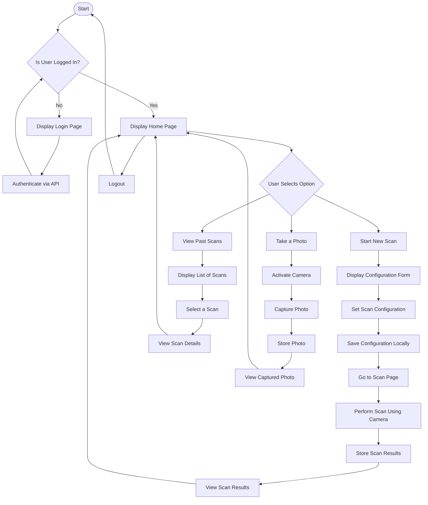

### Basic Workflow

This flowchart includes steps for user authentication, starting a new scan, viewing past scans, and using the camera for taking pictures.

This flowchart provides a visual representation of the typical user interactions within the app, making it easier to understand the user journey and identify any additional features or steps that might be necessary.
