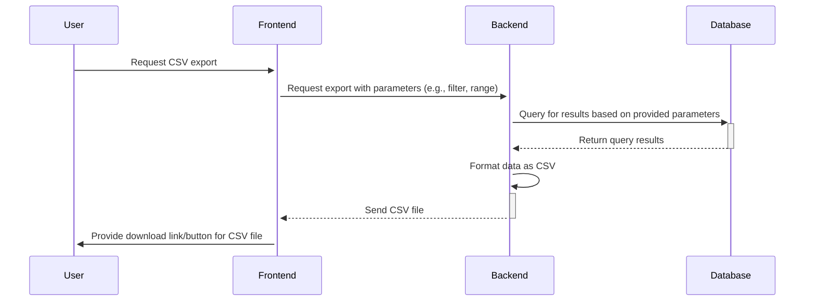

# Export as CSV

Here’s a sequence diagram for the process of exporting scan results as a CSV file. This involves the user requesting the CSV export, the frontend communicating with the backend to process this request, and then the backend fetching the data and returning it in CSV format.

This sequence diagram provides a clear visualization of the steps involved in exporting data as a CSV file, from user request through data formatting and delivery. This functionality is especially useful in applications where data portability and offline data analysis are important features.