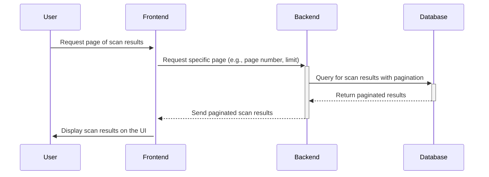

# Pagination Example

Here’s a sequence diagram detailing the process of fetching all previous scan results and displaying them on the frontend with pagination. This involves the user requesting a page of results, which the frontend handles by communicating with the backend, which in turn retrieves the data from the database and returns it to the frontend.

This sequence outlines the interactions involved in fetching and displaying paginated scan results. This process ensures that the system can efficiently handle large datasets by only fetching and displaying a manageable subset of data at a time, which is crucial for performance and usability.
