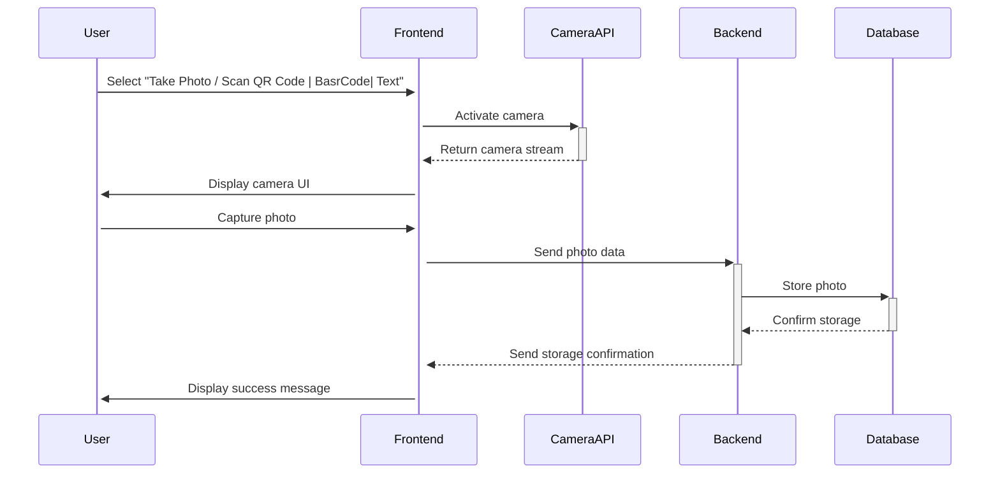

# User simple sequence diagram of a user scanning a QR code

Below is a sequence diagram describing the interaction between the components involved in the process of taking a photo and storing it into the database. This diagram will cover the sequence of actions from the user initiating the photo capture to the photo being saved in the MongoDB database.

This sequence diagram provides a clear, step-by-step visualization of the interactions involved in capturing and storing a photo in the system. It helps in understanding the flow of data and control between different parts of the application, which is essential for both development and troubleshooting.
